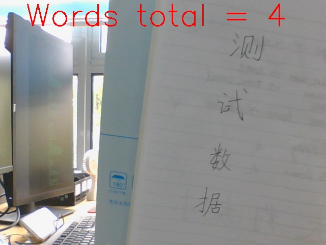

# writing_words_counter

# with the help of paddlehub model(chinese_ocr_db_crnn_server) , implement words counter for image
https://www.paddlepaddle.org.cn/hubdetail?name=chinese_ocr_db_crnn_server&en_category=TextRecognition


# output -- log

```
[{'save_path': '', 'data': [{'text': '测', 'confidence': 0.988754391670227, 'text_box_position': [[411, 60], [487, 68], [481, 130], [405, 122]]}, {'text': '式数据', 'confidence': 0.7919352054595947, 'text_box_position': [[380, 188], [457, 202], [414, 446], [337, 432]]}]}]
----- all text --------
测
式数据

```

# output -- image


